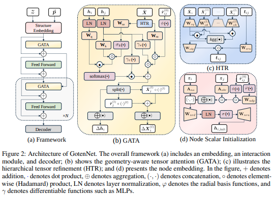

</img>

## GotenNet - Pytorch (wip)

Implementation of <a href="https://openreview.net/forum?id=5wxCQDtbMo">GotenNet</a>, new SOTA 3d equivariant transformer, in Pytorch

## Citations

```bibtex
@inproceedings{anonymous2024rethinking,
    title   = {Rethinking Efficient 3D Equivariant Graph Neural Networks},
    author  = {Anonymous},
    booktitle = {Submitted to The Thirteenth International Conference on Learning Representations},
    year    = {2024},
    url     = {https://openreview.net/forum?id=5wxCQDtbMo},
    note    = {under review}
}
```
